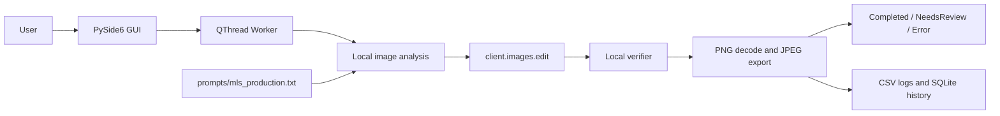

# Direct Production Architecture

## Scope

This document describes the frozen Direct production application at source
commit `b5b6b231d626551198f5e440f0faa4be99d03020`. It does not describe proposed V2
work.

The application is intentionally concentrated in
`myestatepics_ai_editor.py`. The external production prompt is
`prompts/mls_production.txt`, and `packaging/direct_runtime.py` supplies the
side-by-side packaged application identity.

## Production API boundary

Production uses one OpenAI SDK operation:

```python
client.images.edit(
    model="gpt-image-2",
    image=image_file,
    prompt=full_prompt,
    size=requested_size,
    quality=selected_quality,
    output_format="png",
)
```

The SDK operation maps to `/v1/images/edits`. The application contains no
production `client.responses.create(...)` call, no GPT-5.6 model reference, and
no separate paid AI-analysis request. Local NumPy/Pillow analysis only creates
numeric measurements and an adaptive text addendum before the single image
edit.

One successful image therefore produces exactly one paid direct image-edit
request. A transient failure may retry that same operation under the documented
retry policy. There is no automatic Images/Responses fallback and no second
model call after a successful response.

## Component and data flow



For each eligible source:

1. The worker performs local brightness, contrast, shadow, highlight, and
   conservative white-balance measurements.
2. It appends numeric, image-specific guidance to the external production
   prompt.
3. It sends the source and combined prompt to the direct Images Edit endpoint.
4. It decodes the returned PNG.
5. The local verifier compares source and result measurements.
6. It exports once as JPEG beginning at quality 95, preserving safe EXIF and
   ICC data where supported.
7. It atomically writes the result and records CSV and SQLite history.

The OpenAI `size` value follows supported orientation classes:
`1536x1024` landscape, `1024x1536` portrait, or `1024x1024` square. It is not an
arbitrary source-pixel dimension. The original source aspect orientation is
preserved, but nonstandard source aspect ratios may not be pixel-dimension
identical after generation.

## Quality mapping

The GUI values map directly to the API:

| GUI selection | API argument |
| --- | --- |
| Low | `quality="low"` |
| Medium | `quality="medium"` |

Low is the startup default. The worker passes the selected value into
`process_batch()`, which validates it and uses it in `client.images.edit`.

## Retry behavior

`call_image_editor()` allows up to three attempts. It retries only recognized
transient conditions: HTTP 429, 500, 502, 503, or 504 and the SDK's rate-limit,
connection, internal-server, and timeout error types. Backoff begins at three
seconds and doubles between attempts.

Authentication, validation, moderation, malformed-response, and other
non-transient failures are not automatically retried. Each retry is another
paid-request attempt and must be considered when reconciling dashboard cost.
There is no fallback to another API.

## Cancellation behavior

The GUI worker runs in a `QThread` and shares a thread-safe
`CancellationToken`. Pressing **Cancel**:

- records `Cancelled by user` immediately;
- disables repeated cancellation;
- does not attempt to terminate an in-flight HTTP request;
- lets the current image finish naturally and preserves its output;
- prevents the next queued image from starting;
- marks the batch cancelled; and
- restores controls when the worker completes.

Cancellation is checked between images. It cannot eliminate time or cost
already incurred by the active request.

## Verification, routing, and export

The API response is requested as PNG and decoded to RGB. Optional automatic
sharpening is disabled. The verifier measures sharpness, brightness shift,
highlight clipping, shadow crushing, and brightness-independent chromaticity
shift.

A hard verifier failure, invalid generated dimensions, or inability to fit the
JPEG within the MLS target routes the result to `NeedsReview` with an explicit
reason. Normal successful edits go to `Completed`. Runtime failures create an
Error report.

JPEG encoding starts at quality 95. If the result exceeds 2,000,000 bytes,
quality is reduced in steps to the supported minimum; an image still above the
limit is retained and routed to review. The exact filename is preserved.

## Eligibility and persistence

Current output files—not history—control eligibility. A source is skipped only
when the same filename currently exists in the active mode's `Completed`,
`NeedsReview`, or `Error` result folder. Deleting that current output makes the
source eligible on the next scan or Analyze operation.

CSV logs and SQLite history remain useful for reporting and learning but never
block reprocessing. Demo results are isolated from production results.

## Configuration and packaged isolation

Source mode reads the repository-root `.env`. The side-by-side Direct package
sets `MYESTATEPICS_APPLICATION_NAME` through
`packaging/direct_runtime.py` before the application module loads. Its data
root is:

```text
~/Library/Application Support/MyEstatePics AI Editor - Direct/
```

On first launch, the Direct edition can copy a legacy `.env` into that
directory without altering the source file. The API key is never bundled or
logged.

## Cost controls

- one direct model operation per successful image;
- no GPT-5.6 orchestration;
- no paid AI analysis;
- no automatic cross-API fallback;
- paid-batch confirmation before production starts;
- selected-file processing and current-output eligibility;
- Low as the default quality;
- estimated per-image and batch costs shown before and after processing; and
- Demo Mode for free workflow checks.

Displayed amounts are estimates based on observed project costs, not invoice
data. The OpenAI dashboard is authoritative.

## Known limitations

- Generative editing cannot guarantee pixel-identical preservation. Human
  comparison remains required for architecture, materials, mirrors, text,
  reflections, and exterior content.
- The local verifier cannot reliably detect semantic inventions such as fake
  windows or altered reflected objects.
- Retry attempts can increase cost and elapsed time.
- OpenAI may omit token/usage fields for image responses.
- Cost displays are estimates and may differ from dashboard billing.
- The application is sequential; the current request must finish before
  cancellation takes effect.
- The current installer is Apple Silicon and ad-hoc signed, not Developer ID
  signed or notarized.
