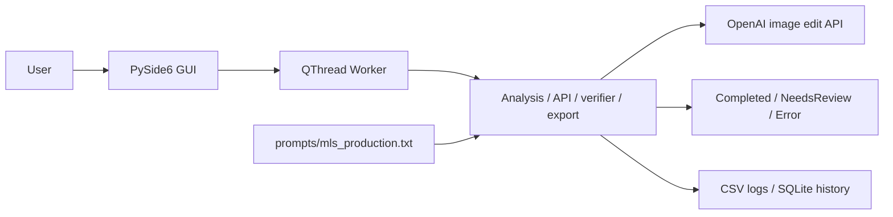
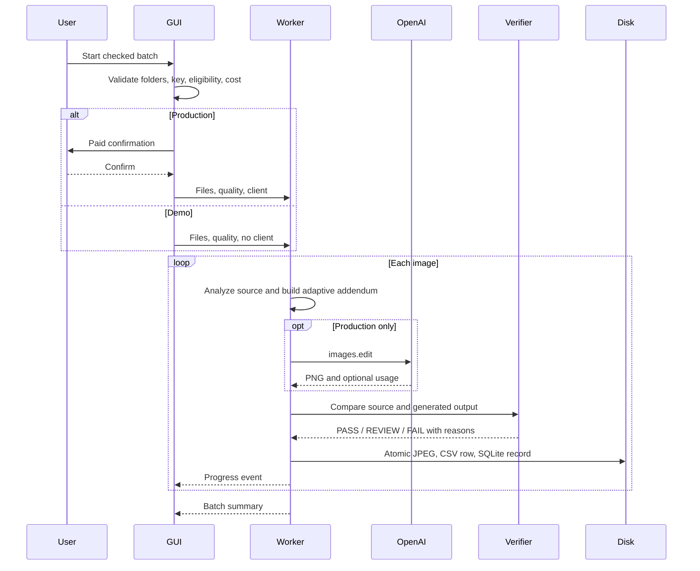

# Technical Design

## System context

Production v2.1 RC1 is a single-process PySide6 application. The implementation
is intentionally concentrated in `myestatepics_ai_editor.py`; the prompt and
legacy baseline are external files.

## Application modules

There is one production Python module:

- configuration and resource discovery
- API-key loading
- input analysis and adaptive prompt addendum
- OpenAI request and retry handling
- JPEG/EXIF/ICC export
- deterministic verifier
- CSV and SQLite persistence
- real and Demo batch processors
- review file operations
- PySide6 windows and worker

`legacy/` is a reference snapshot and is not imported by the current GUI.

## GUI architecture

`launch_gui()` imports PySide6 and defines:

- `MainWindow`: header, job setup, Advanced Folders, image table, activity log,
  and processing footer
- `ReviewWindow`: original/output comparison and result actions
- `Worker`: a `QObject` moved to `QThread`, emitting progress and completion

Incoming scans select all supported files by default. Programmatic table
updates are signal-blocked and guarded through startup settling so checkbox
events cannot clear the selection. User changes update count and cost
immediately.

## Processing workflow

Input analysis measures luminance, contrast, shadow/highlight fractions, and a
conservative white-balance signal. These measurements create an additive,
image-specific instruction; they do not replace the production prompt.

## Prompt loading

`resource_path()` resolves bundle resources through PyInstaller `_MEIPASS` and
source resources beside the module. `load_prompt()` reads
`prompts/mls_production.txt` at runtime. `PROMPT_VERSION` is independent from
the API key and application version.

## OpenAI integration

Production creates `OpenAI(api_key=api_key)` explicitly. `client.images.edit`
uses `gpt-image-2`, the selected Low/Medium quality, native orientation-based
size, PNG response format, the original image, and the combined prompt.
Transient errors retry up to three attempts with backoff. Demo Mode never
creates the client.

## Verification and export

Generated images are converted to RGB. Optional automatic sharpening is
disabled in current configuration. The verifier measures normalized sharpness,
adaptive brightness shift, highlight clipping, shadow crushing, and
brightness-independent chromaticity shift. Verifier `FAIL` routes to
NeedsReview with reasons. A verifier `REVIEW` advisory is recorded but does
not alone prevent Completed routing. Invalid dimensions and hard output-size
failure also route to NeedsReview. Runtime exceptions create an Error text
report rather than a processed image.

JPEG encoding begins at quality 95 and attempts odd values down to 79 while targeting
2,000,000 bytes. An oversize result is retained and routed for review. EXIF
orientation is normalized to 1; safe EXIF and ICC data are retained where
supported. Writes use a temporary file and `os.replace`.

## Folder scanning and eligibility

The application scans on explicit lifecycle events rather than monitoring
continuously. Eligibility is determined only from current same-named files in
the active result folders. CSV, SQLite, cached scans, and earlier runs do not
block reprocessing. Demo and production paths are isolated.

## Configuration and storage

Source mode loads `.env` from the repository and stores result data below the
repository runtime folder. QSettings preferences and startup logs still use
Application Support. Packaged mode reads only:

`~/Library/Application Support/MyEstatePics AI Editor/.env`

Packaged shell and repository keys are ignored. QSettings uses
`preferences.ini` in Application Support for folders, window size, Demo state,
and Advanced Folders state. Default packaged runtime, logs, data, and cache are
also created there.

## Logging

Startup diagnostics record application start/exit, uncaught exceptions,
execution mode, resource path, selected `.env` path, and whether a key was
found. Key values are never logged. Per-run CSV rows contain processing,
destination, verifier, cost, and usage data. SQLite stores per-image history
and review labels.

## Packaging and build architecture

`build_macos.sh` cleans outputs and invokes PyInstaller in windowed, onedir
mode. It bundles the prompt and optional resource directories, sets bundle
metadata, rejects bundled `.env` files, and ad-hoc signs and verifies the app.
`build_dmg.sh` stages the app with an Applications shortcut and calls
`hdiutil`. See [Build Guide](BUILD_GUIDE.md).
